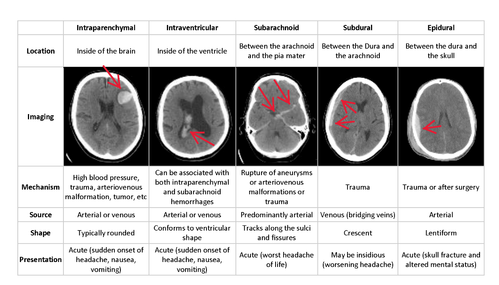
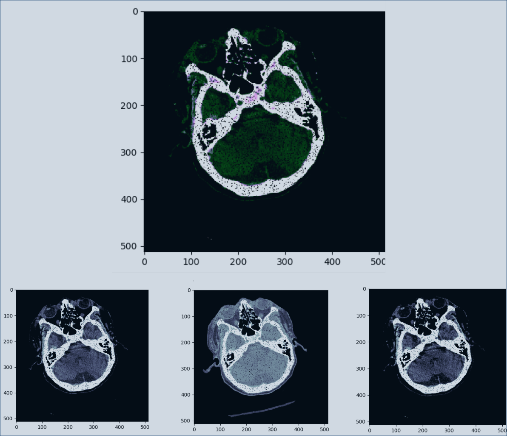

# intracranial-hemorrhage-detection
Repo for RSNA intracranial hemorrhage detection. Instructions for reproducability can be found below.

## Overview
Intracranial hemorrhage (bleeding within the cranium) accounts for ~10% of strokes in the U.S., where stroke is the fifth-leading cause of death. There are several types of hemorrhage and indentifying/locating them in a patient quickly is not only a matter of life and death, but speed also plays a critical part in the quality of life a survior can expext post recovery.

Diagnosing and locating an intracranial hemorrhage from neurological symptoms (e.g. severe headache or loss of consciousness) and medical imagery is a complicated, time consuming process requiring a highly trained spcialist. A technology solution would enhance the speed and diagnostic ability of medical practioners as well as potentially provide diagnostic ability or relief to patients who are not near an expert. Our goal is to build a model and system which detecs acute intracranial hemorrhages and its subtypes. 


## Data
The dataset has been provided by the Radiological Society of North America (RSNA®) in collaboration with members of the American Society of Neuroradiology and MD.ai.

## Data Augmentation
Data is augmented via random flips (vertical and horizontal), rotations (+/- 10 degrees), Salt&Pepper noise, and affine transformations (deformation) to help capture the invariants. This also helps to upsample class 1 data. We also window channels sepretly. In the image below we show a 3 channel img combined via np.dstack(), and the corrosponding individual channels. The windowing used on this particular hounsfield normalized data are: brain, subdural, and blood. We also apply image normalization to help the CNN. 



Furthermore we also downsample class 0 data by randomly selecting images to match the number of class 1 training data. When training binary cross entropy for "any" class 1 subtype, we set all subtypes to class 1 and an equal amount of class 0 to 0 

## Model
Based on InceptionV3
```
num_epochs = 8
img_shape = (256,256,3)
batch_size=24
learning_rate=5e-4
decay_rate=0.8
decay_steps=1
weights="imagenet"
verbose=1
```

## Evaluation
Model evaluated using a weighted multi-label logarithmic loss (same as cross-entropy for all intents and purposes). Using the minmax rule to avoid undefinned predictions at {0,1}, offset by a small epsilon: max(min(p, 1−10^−15), 10^-15).

## Team
- Chris Chen
- Tony Reina
- Kyle Shannon

## Getting Started, Training, & Testing Instructions:
Instructions for deploying our codebase and reproducing our results:
1. Run the shell script ```create_config.ini```, also create the following directories if they do not exist: submissions/, models/, eda/, logs/, src/tensorboards, and src/model_defs 
2. Set you config.ini script, use_docker must be true if you are training with our docker script, you must also set your docker paths to the data, in our case we mounted a drive to the docker container, our docker run command looks like this:
```
docker run \
  --mount type=bind,source=/media/mount_point/intracranial-hemorrhage-detection-data,destination=/home/data \
  --mount type=bind,source=/home/kyle/dev/kaggle/intracranial-hemorrhage-detection,destination=/home/intracranial-hemorrhage-detection \
  --name baseline \
  --gpus all \
  --expose=8888 \
  --rm \
  -it rsna-kaggle
```
3. Run the Docker script to create a GPU ready linux container. (We assume you will be using Nvidia GPUs on a Linux based system. We also use tmux in the docker container during training.
3. Ensure that the conda environment was set up properly and matches the .yaml environment configuration. 
4. Training was perfoemd using train.py, model.py, and data_loader.py many ideas we wound up using in our final model came from several 
5. Inference is performed using the inference.py file. The batch size for inference must be 1 or evenly divisible by the dataset being tested.

## Final Results:
We ended up training a model for 3 epochs based off of InceptionV3. This model was trained off of stage_1_training images. We did not perform any additional training in stage 2 with the updated training data and produced a result of 0.185 loss on 1% of the final stage 2 test data. Will update when we have the final results.


## OLD Model Training Instructions:
These instructions were for the original idea we had of training seperate binary cross entropy models and predicting on class "any" first. We decided to abandon this pursuit when using a categorical cross entropy loss approach and a vector of all subtype including any, proved to be easier to get better results in the limited time we had.

start training via:
python train.py {model-name}-{dims}-{loss}-{subtype}-{monthDay-version}
e.g.
`$ python train.py resnet50-dim224x224-bce-intraparenchymal-oct18v1`

After training is complete, please create a folder in the google drive shared folder with the models name (e.g. resnet50-dim224x224-bce-intraparenchymal-oct18v1) in that folder please upload the model.pb, model's tensorboard folder, and the current src/ folder that was used to train the model, that way we are ensured to know which copy of the data_loader etc was used to train the model. Note you might need to `$ sudo chown user ./dir/*` the models and tensboard folder, because the permissions may be different from the docker container when writing to local disk.

In the google spreadsheet, you can add more info about the model, anything interesting you noted and be on your merry way. Thanks!
I used the following arguments for IH subtypes on ResNet50:
```
BATCH_SIZE = 32
EPOCHS = 15 
DIMS = (224,224)
training_data_gen = DataGenerator(csv_filename=TRAIN_CSV,
                                    data_path=DATA_DIRECTORY,
                                    batch_size=BATCH_SIZE,
                                    dims=DIMS,
                                    augment=True,
                                    balance_data = True,
                                    subtype = "intraparenchymal",  ####### <-- change this
                                    channel_types = ['subdural','soft_tissue','brain']) ### <-- we are using these windows?
validation_data_gen = DataGenerator(csv_filename=VALIDATE_CSV,
                                    data_path=DATA_DIRECTORY,
                                    batch_size=BATCH_SIZE,
                                    dims=DIMS,
                                    augment=False,
                                    balance_data = True,
                                    subtype = "intraparenchymal",  ####### <-- change this
                                    channel_types = ['subdural','soft_tissue','brain']) ### <-- we are using these windows?
```
